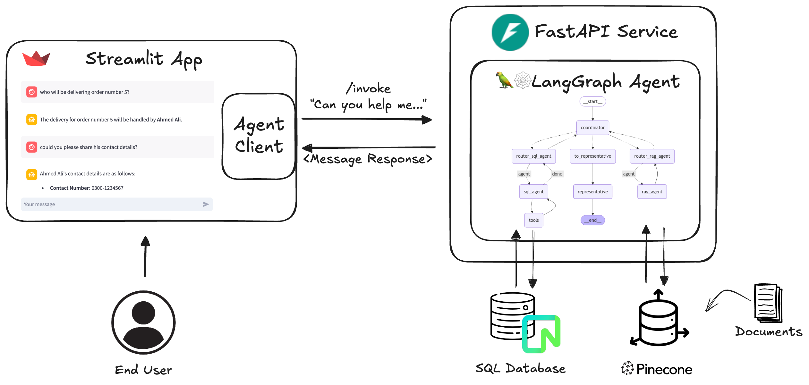
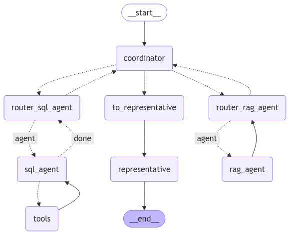

# RAG-Enterprise-Chatbot

This repository contains the data and code for implementing enterprise level AI solution to answer both internal and external general queries of employees and customers
## Quick Start

Follow these steps to get the RAG-Enterprise-Chatbot up and running:

1. Navigate to the source directory:
    ```sh
    cd src
    ```

2. Create a `.env` file and set the following variables:
    ```sh
    DATABASE_URI_RO=<your_read_only_database_uri>
    OPENAI_API_KEY=<your_openai_api_key>
    PINECONE_API_KEY=<your_pinecone_api_key>
    HUGGINGFACE_API_KEY=<your_huggingface_api_key>
    COHERE_API_KEY=<your_cohere_api_key>
    ```

3. Activate the appropriate environment (conda, venv etc):
    ```sh
    source <your_environment_activation_script>
    ```

4. Run the FastAPI web server:
    ```sh
    python run_service.py
    ```

5. In a separate terminal, run the Streamlit app:
    ```sh
    streamlit run app.py
    ```

## System Architecture


## Orchestration of Multi-Agents
